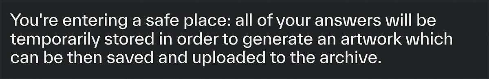
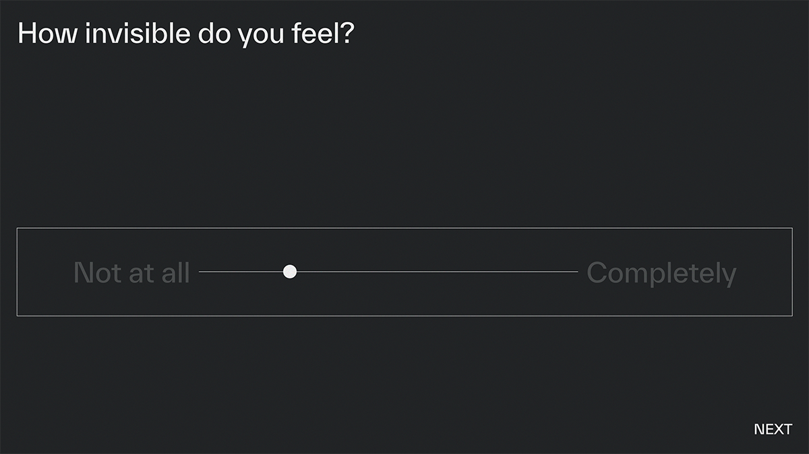

# About

METANOISE is a virtual space and interactive experience created for the Creative Coding course held at Politecnico di Milano. _If there was a button to restart your whole life, would you press it?_ In this website, people will be asked to answer questions like the aforementioned, all based on the concept (or idea) of _intrusive thoughts_: unwanted thoughts that can pop into our heads without any warning. These thoughts, that reveal parts of the inner reality of a human being, regard 5 dimensions: violence, sexuality, identity, beliefs and relationships. By answering, the users will leave a path that will be _translated_ into an _intimate postcard_. Each postcard is unique: it represents the reflection of the user's inner self. At the end of the experience the image will be collected in an archive where all the postcards generated can be visualized together in a randomized fashion. We hope that you'll enjoy this intimate experience as much as we did when building it.

**Table of Contents**

1. Project idea<br>
   a. [Concept](#concept)<br>
   b. [Context of use](#context-of-use)<br>
2. Structure<br>
   a. [Homepage](#homepage)<br>
   b. [Questions](#questions)<br>
   c. [Archive](#archive)<br>
3. The Code<br>
   a. [Design challenges](#design-challenges)<br>
   b. [Coding challenges](#coding-challenges)<br>
4. [Team](#team)<br>

# Project idea

## Concept

The concept interprets the idea of metamorphosis with a translation of data into images. The users' thoughts are processed by an algorithm that creates a visual representation of them.

The website proposes itself as a virtual space where people can leave a trace of their cognitions—a safe place in which to find an outlet for their thoughts outside of the real world.

The user provides real-time data by answering questions related to the five spheres of intrusive thoughts (violence, sexuality, identity, beliefs and relationships). The questions touch on mental intrusions defined by Stanley Rachman as _"any recurrent, unacceptable, unwanted thought accompanied by subjective emotional distress"_. The algorithm interprets how users interact with the questions, returning a direct visualisation of their interaction after the last question is answered. All of the data is recorded locally and temporarily (client-side) to ensure a more than sufficient level of privacy.

## Context of use

The atmosphere that is generated by this experience is particularly intimate: for this reason, it is fundamental to leave as much control over the surrounding environment to the user, which shouldn't feel distracted. In fact, it is up to each user to choose their preferred device, as the website is fully responsive (mobile first) and cross browser.

# Structure


## Homepage


The homepage aims to show the key elements of the web experience.

First, the user will see the logo: the name **Metanoise** indicates a transformation—a metamorphosis—in the path from raw data to meaning. The word _metanoise_ is commonly used in the field of cybernetics to describe inaccurate and irrelevant data generated by systems with a pattern based on an uncontrolled vocabulary. By bringing this meaning within the cognitive sphere, **Metanoise** could be representative of the set of unconscious and unwanted thoughts that self-generate in our minds and create distressing noise. The animation in the background leaves a glimpse of what the generated postcards—or better, artworks—could become after the algorithm calculates all of the answers given in the Questions page.

In the Questions page, the user will be given two warnings: The first concerns the usage of data, which is temporarily recorded in order to generate the final output and then permanently discarded after extiting the page. The second, is instead focused on the physical space surrounding the user: the environment must be quiet and comfortable.





When the user is ready to start they can press the START button.

## Questions

The web pages dedicated to questions are in fact the core section of the project, and it is where the user can take part in an experience that sits somewhere between a psychotherapeutic session and a confessional.

All the questions are grouped under the five categories, and they were heavily scrutinised in order to minimize as much as possible potential triggers or particularly sensible/thorny topics involving past trauma or mental conditions.

Each question was analysed in order to establish what kind of answers it needed: this means that some answers are articulated through the use of sliders, others through an _unlimited_ text field, and others via multiple choice.




The look and feel of the question page stands out thanks to its darker background colour, which communicates confidence and calmness. This is why the webpage is different—in terms of visual language and hyrearchy—from the other two (the home page and the archive page): here the user's attention must be maximised so that a strictly personal work of art can be created. The image has to represent the image of the inner debate that these topics presented will raise.

## Archive


The metamorphosis is completed in the archive: a web page that collects all the images generated by the algorithm. Each visual representation is anonymous and belongs to a unique user. Therefore, the archive can be described as a gallery of our subconscious which tells connections and differences between people, but without making them explicit.

**Metanoise** is a place where ephemeral, incomplete and non-identifying data—which concern the emotional sphere, private thoughts and judgements that constitute us as individuals—is transformed.

# The Code

## Design challenges

The design of the website is focused on the overall perception of the user's experience, a helpful atmosphere created in order to introduce people into their introspective path. The main colors of the page are two different shades of gray: for the homepage and the archive a lighter one (#DFDEE2), almost aseptic and scientific, while for the questions page a deeper shade (#232628) was chosen in order to suggest an immersive and meditative atmosphere.


The font selected for the project is named Everett, released in 2021 and designed by Paparelli for the foundry type.weltkren. [Directly from the specimen: «Strong typographic details add a high tension while keeping a reading comfort, finding the right balance between a font that is graphic yet fluid.»]
The symmetry of the font puts the user in a visually comfortable situation. The interruptions of the lines refer to the concept of **Metanoise**: ephemeral data, usually defined as useless, that inside of this website becomes a protagonist.

Another challenge regarded the parameterization of the artwork. The visual parameters taken into consideration are:

- The number of the squares per grid
- The color palette
- The specific shade of each color and their quantity
- The blur effect of the overall image

The grid (and so the resolution of the noise pattern) is determined by the average of the characters typed within all of the open questions:


> 1 to 16 characters = 6 × 6 grid, 17 to 32 = 9 × 9 grid, 33 to infinity = 12 × 12 grid.

Each section has been assigned a color and two different shades of it. The quantity of a particular color is determined by the time spent in the section associated with it in relation to all of the others: if in an artwork is strong the presence of red, it means that the user treated the subject of violence with caution, and took more time to get to the bottom of what they thought.


The shades are tied to the multiple choice options: a darker shade corresponds to a true option (typically a positive response, like "Yes"), and a lighter shade corresponds to a false option (typically a negative response, like "No"). The assigned shades for each section are:

- violence: #FE0000 (darker shade), #FF6432 (lighter shade);
- sexuality: #FF1493 (darker shade), #FE3EEF (lighter shade);
- identity: #7722F6 (darker shade), #B44EF2 (lighter shade);
- beliefs: #1D64FF (darker shade), #37C3FF (lighter shade);
- relationships: #ABFF38 (darker shade), #D6FA26 (lighter shade).


Finally, the blur effect is defined by the average percentage of the sliders: the closer you are to the center, the sharper the image.

## Coding challenges

The initial problem we had was _how to create this experience with a cross platform and mobile first mindset_. For this reason, we decided to make the structure of the website as simple as possible, by not only limiting the number of html pages but also the number of external dependencies (which for this project are p5 and Firebase). This meant that only vanilla HTML, CSS and JS were used to create it.

After having decided how to structure the website, we started to work on the core part of it, the Questions page. It is linked to three different JS files: one to manipulate the different sections written in raw HTML and CSS, the other to declare the artwork class and its methods, and the last to connect and upload an artwork to a Firebase real time database.

In order to maximise the usage of the Pp5 library, we decided to use its blur filter in order to accomodate our design vision. Its main drawback is hardware utilisation: it's calculated inside of a canvas and more particularly in real time, so we had to reduce as much as possible the number of frames, and more specifically we took advantage of the `noLoop()` function.

#### p5 artwork sketch (Questions page – questions.js)

```javascript
function setup() {
  createCanvas(540, 540).parent("artwork-buffer");
  pixelDensity(1);
  rectMode(CENTER);
  noStroke();
  background(255);
}

function draw() {
  if (artworkIsLoading) {
    generatedArtwork.display();
    noLoop();
    artworkSnapshot.src = canvas.toDataURL();
    setTimeout(() => {
      loadingContent.className = "container hide";
      loading.className = "section hide";
      setTimeout(() => {
        artwork.className = "section show";
        artworkContent.className = "container show";
      }, 750);
    }, 750);
  }
}
```

As we can see, the artwork is calculated only one time, via it's display option. Then, the content of the hidden canvas (that is—in fact—a buffer) is put inside of the src property an already present image element. It is important to note that an instance of the artwork is created before, during the loading animation.

This implementation made the anonymisation of the artwork possible, as it is uploaded to the Firebase real time database as a B64 PNG file without any other data attached to it:

```javascript
function saveArtwork() {
  let date = new Date();
  let currentDate =
    date.getFullYear() +
    "-" +
    (date.getMonth() + 1) +
    "-" +
    date.getDate() +
    "-" +
    date.getHours() +
    "-" +
    date.getMinutes() +
    "-" +
    date.getSeconds();
  saveCanvas("my metanoise_" + currentDate, "png");
}

function upload() {
  addArtwork(artworkSnapshot.src);
  setTimeout(() => {
    window.open("../archive/archive.html", "_self");
  }, 750);
}
```

The archive page is also linked to the Firebase JS file: inside of it we can find the addArtwork and onValue functions:

#### addArtwork and onValue functions (Questions page and Archive page – firebase.js)

```javascript
// retrieve the stored artworks and put them inside the grid randomly
onValue(artworksRef, (snapshot) => {
  allArtworks = snapshot.val();
  allArtworksArray = Object.values(allArtworks);

  const imageWrapper = document.getElementById("image-wrapper");

  if (!imageWrapper) {
    console.log("the image-wrapper element was not found");
    return;
  }

  while (imageWrapper.childElementCount) {
    imageWrapper.innerHTML = "";
  }

  let i = 0;
  for (const artwork of allArtworksArray) {
    // add noise, like noise(i) * 5
    // generate a number
    let span = Math.floor(Math.random() * 3);

    // add a random number of empty elements before another image
    for (let x = 0; x < span; x++) {
      const emptyDiv = document.createElement("div");
      emptyDiv.classList.add("image-container");
      imageWrapper.appendChild(emptyDiv);
    }

    // add an artwork
    const el = document.createElement("div");
    el.classList.add("image-container");
    const img = document.createElement("img");
    img.src = artwork;
    img.classList.add("artwork-snapshot");
    el.appendChild(img);
    imageWrapper.appendChild(el);

    i++;
  }
});

// add an artwork
addArtwork = (data) => {
  // create a reference
  const newArtworkRef = push(artworksRef);
  // add data to the database
  set(newArtworkRef, data);
};
```

In order to maintain the randomness theme even inside of the archive, each time an user access it the B64 images are put inside of a div element along with a random quantity of blank areas.

# Team

Meet the team **Creative Cose**


## Credits

Draw With Code: Creative Coding 2021/2022 <br>
Politecnico di Milano – Dipartimento di Design

### Faculty

- Michele Mauri
- Tommaso Elli
- Andrea Benedetti
